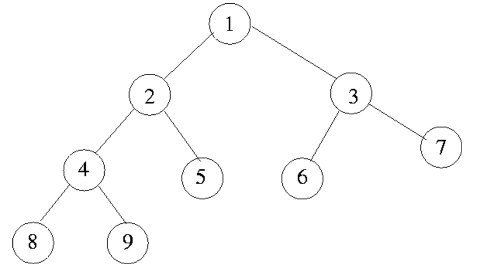

### Time and Space Complexity for Solution-3

#### Time Complexity
- If we consider the nodes 8 & 7 in the given example tree, Our search begins at the given nodes.
Here, the height of the example tree is 4.
After 3 recursive calls our function should return the node 1 as the LCA of node 8 & 7.

- For the nodes 5 & 6 the LCA is also node 1, which is found after 2 iterations where the tree height is 3.
- Therefore, the Time Complexity for this algorithm is **O(n-1)**

#### Space Complexity
- Considering the above explained cases we get Space Complexity for this algorithm as **O(h-1)**. Where **h** is the height of the tree from root to the given nodes.
